# UpyPhone
Micropython code to implement a GSM mobile phone. The functionality includes voice and SMS. The hardware consists of a pyboard, an LCD160CR colour touch screen and a SIM800L module as pictured below. It is mounted on a homebrew matrix board skin which plugs into a pyboard. Below the SIM800L is a lipo charger - see below.

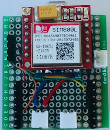.........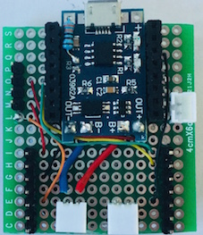 

The following two images show the front and rear views of the assembled phone. 

 
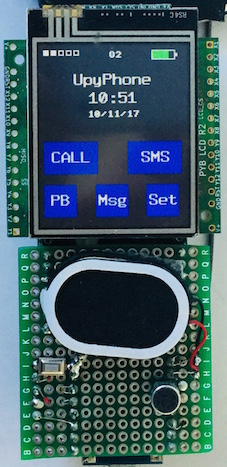.........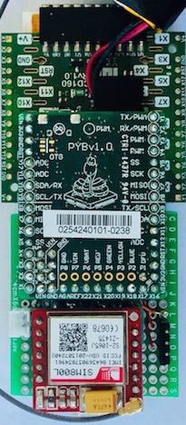 

## Wiring

| SIM800L pin | Pyboard pin |
|:-----------:|:-----------:|
| RXD         |   X1        |
| TXD         |   X2        |
| RING        |   X5        |

In addition, the button switch on the SIM800L skin is connect to ground and to pin X12 on the pyboard - pressing this button wakes up the display and sim800l.

## User Interface

The following describes the User interface and functionality of **UPyPhone**.

### Home Screen
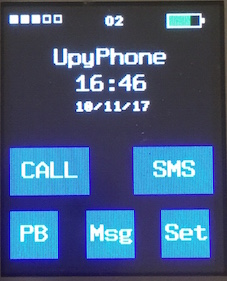   
 The home screen displays the current signal strength, current network that the phone is registered on and the battery charge level together with time amd date (set automatically from the network). The **CALL** button starts a call by moving to the dial screen to enter the number. The **SMS** button also first changes the screen to dial and then to the write message screen once the destination number has been entered. **PB** changes the screen to the PhoneBook screen, **Msg** to the read message screen and **Set** to the Settings Screen.
 
### Dial Screen
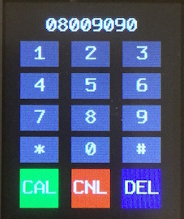.........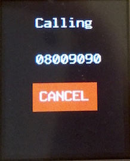  
After a number is input using the numeric buttons, **CAL** starts the call, changing screens to the calling screen as pictured. The **CANCEL** button hangsup the call and reverts to the home screen. The **CNL** button on the dial screen also reverts to the home screen without making the call. The **DEL** button deletes the last dialled digit.

### Read Message Screeno
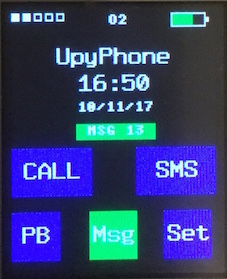.........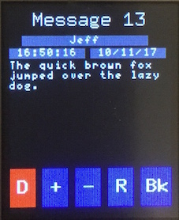  
An incoming SMS is indicated by colouring the **MSG** button green  on the  home screen as well as displaying the location that the message is stored in the sim800l module. The message is read by pressing the **MSG** button which retrieves the message and displays it as shown above. **+** and **-** step through the messages. **D** deletes the currently displayed message and **Bk** reverts to the home screen. 

### Write message screen
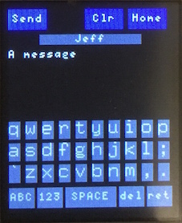.........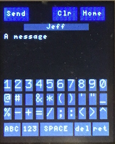  
Once a destination has been specified either by the Phone Book or by the dial screen, this screen is used to compose messages. **ABC** moves to capitals and **123** to numbers and symbols as shown. 

### Phone Book
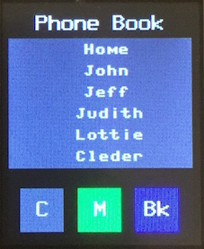.........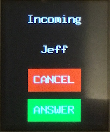  
Phone book entries are currently declared statically in *phoneui.py*. A calling (or message sender) number is translated to the name of an entry if it is in the phone book. Pressing an entry in the phone book either starts a voice call or an SMS message depending on whether **C** (call) or **M** (sms) has previously been pressed - indicated by a green button background. **Bk** returns to the home screen.

### Settings Screen
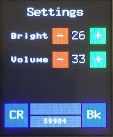  
Adjust screen brightness and speaker volume. The number at the bottom is pyboard free heap space which is periodically updated (with the current state of code, the maximum free heap is around 50K). **CR** requests the user's current free credit for pay as you go simcards - when received, this is displayed in the label above the free heap space.

## Sleep Mode
If the screen is not touched for 30 seonds then the phone goes into sleep mode. In sleep mode, the pyboard is put into the "sleeping" state, the display is turned off and the sim800l module is put into   "slow clock" mode. Power consumption drops from around 80ma to less than 5ma. The phone is woken up by an incoming call, sms or by pressing the wake up button.
